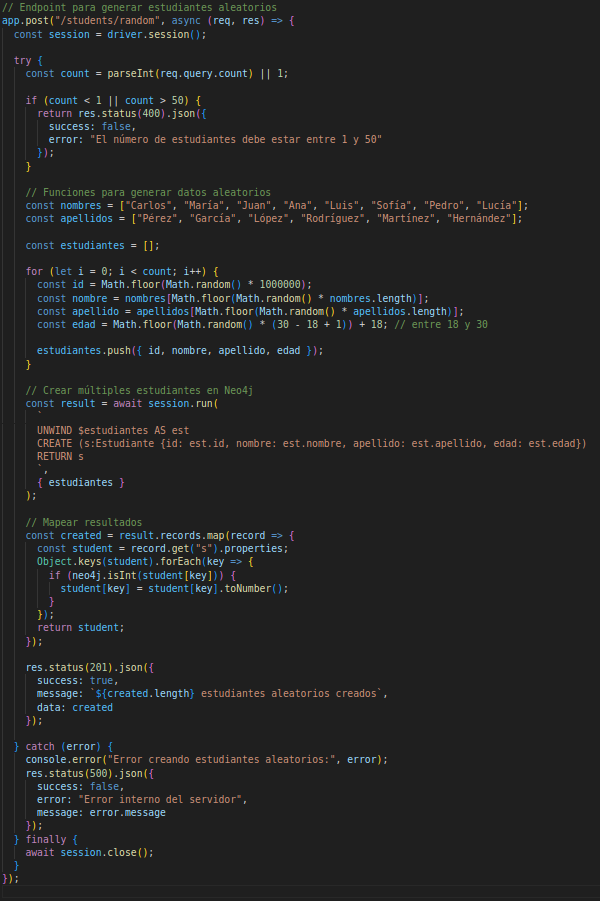
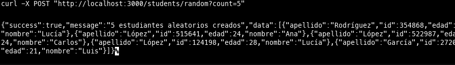
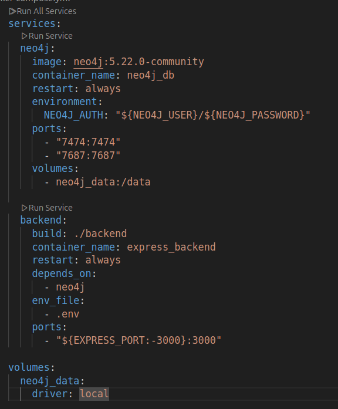
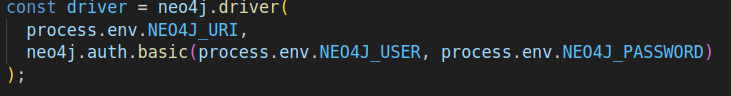
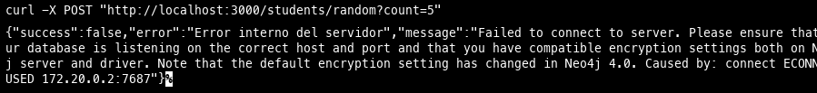
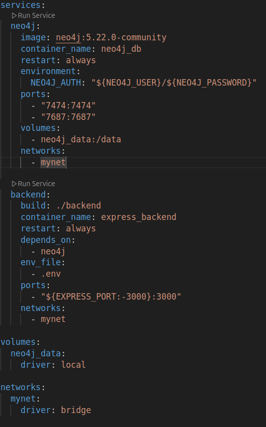
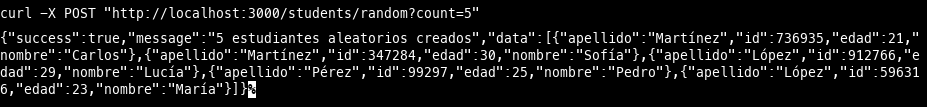

# api-docker-compose

Ya teniamos en previas clases el metodo get de las en nuestra API, procedemos a crear nuestro endpoint POST que me genere en este caso datos aleatorios de estudiantes segun la cantidad pasada por parametro,

## 1b

comprobamos 

## 2 Quitamos las redes de nuestros servicios 

## 2a Realizamos la conexion 

## 2b Verificacion 

Vemos que no es posible realizar la conexion de la API a la base de datos 

## 3 Creamos nuestra red user-defined y conectamos nuestros servicios a esta red creada

## 3b Probamos la conexion

Se puede observa que la peticion fue exitosa, es decir que tenemos una conexion entre nuestros dos servicios 

## Conclusion
Para sistemas distribuidos usar una red user-defined es la mas adecuada tan por la facilidad de comunicacion por sus nombres entre servicios y porque se da un mayor aislamineto y mejor control de la configuracion de la red.

